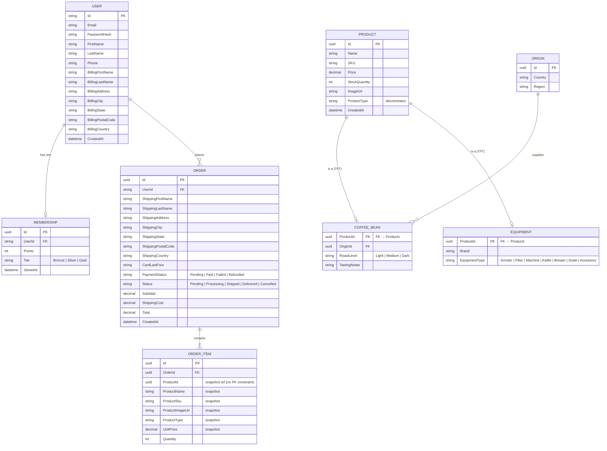

# Coffee Shop Backend API

A RESTful backend for the BeanWorks coffee shop, built with **.NET 10** and **Entity Framework Core**. Covers product catalogue, user authentication, membership tiers, shopping cart orders, and account management.

## Tech Stack

| Layer | Technology |
|-------|------------|
| Framework | .NET 10 (ASP.NET Core Web API) |
| Database | SQLite (local dev) — switchable to PostgreSQL/SQL Server |
| ORM | Entity Framework Core 10 — Code-First, TPT inheritance |
| Auth | ASP.NET Core Identity + JWT Bearer Token |
| API Docs | Swagger UI + Scalar UI |

---

## Entity-Relationship Diagram (ERD)



### Design Notes

**TPT (Table-Per-Type) inheritance for Products**
The `Products` table holds shared columns. `CoffeeBeans` and `Equipments` tables each hold only their type-specific columns, joined via `ProductId`. EF Core handles the join transparently.

**Order snapshots**
`OrderItem` stores a copy of the product name, SKU, image URL, and price at the moment of purchase. This ensures historical orders are never affected by later catalogue changes. `ProductId` is a logical reference only (no enforced FK) for this reason.

**Billing address on User**
`ApplicationUser` stores an optional billing/shipping address so checkout can pre-fill the shipping form automatically.

---

## API Endpoints

### Authentication — `/api/auth`

| Method | Route | Auth | Description |
|--------|-------|------|-------------|
| `POST` | `/api/auth/register` | Public | Register with email, password, first/last name |
| `POST` | `/api/auth/login` | Public | Returns a JWT Bearer token |
| `POST` | `/api/auth/assign-role` | Admin | Assign a role to a user |

### Account — `/api/account`

| Method | Route | Auth | Description |
|--------|-------|------|-------------|
| `GET` | `/api/account/profile` | Bearer | Get own profile + billing address |
| `PUT` | `/api/account/profile` | Bearer | Update phone + billing address |
| `PUT` | `/api/account/change-password` | Bearer | Change password (requires current password) |

### Products — `/api/products`

| Method | Route | Auth | Description |
|--------|-------|------|-------------|
| `GET` | `/api/products` | Public | List all products |
| `GET` | `/api/products/coffeebeans` | Public | List coffee beans only |
| `GET` | `/api/products/equipments` | Public | List equipment only |
| `GET` | `/api/products/{id}` | Public | Get any product by ID |
| `GET` | `/api/products/coffeebeans/{id}` | Public | Get a coffee bean by ID |
| `GET` | `/api/products/equipments/{id}` | Public | Get equipment by ID |
| `POST` | `/api/products/coffeebeans` | Admin | Create a coffee bean |
| `POST` | `/api/products/equipments` | Admin | Create an equipment item |
| `PUT` | `/api/products/coffeebeans/{id}` | Admin | Update a coffee bean |
| `PUT` | `/api/products/equipments/{id}` | Admin | Update an equipment item |
| `DELETE` | `/api/products/{id}` | Admin | Delete a product |

### Orders — `/api/orders`

| Method | Route | Auth | Description |
|--------|-------|------|-------------|
| `POST` | `/api/orders` | Bearer | Place a new order (validates stock, deducts inventory) |
| `GET` | `/api/orders` | Bearer | List own orders (newest first) |
| `GET` | `/api/orders/{id}` | Bearer | Get a single order by ID |

**Order placement validates:**
- All products exist and have sufficient stock
- Shipping address is complete
- Card number is 13–19 digits (simulated — always succeeds)
- Prices are read from the database, never trusted from the client

**Shipping cost rule:** Free on orders ≥ $100, otherwise $10 flat.

---

## Roles

| Role | Granted at | Permissions |
|------|-----------|-------------|
| `Customer` | Auto-assigned on register | Authenticated endpoints |
| `Admin` | Manual via `POST /api/auth/assign-role` | Admin-only product management |

---

## Getting Started

### 1. Run the server

```bash
cd CoffeeShopApi
dotnet run
```

The server starts on `http://localhost:5046`. On first launch it automatically runs any pending migrations and seeds sample data.

### 2. Explore the API

| UI | URL |
|----|-----|
| Swagger | `http://localhost:5046/swagger` |
| Scalar (recommended) | `http://localhost:5046/scalar/v1` |
| OpenAPI JSON | `http://localhost:5046/openapi/v1.json` |
| Health check | `http://localhost:5046/health` |

### 3. Quick auth test

```bash
# Register
curl -X POST http://localhost:5046/api/auth/register \
  -H 'Content-Type: application/json' \
  -d '{"email":"you@example.com","password":"Pass@1234","firstName":"Alex","lastName":"Chen"}'

# Login — copy the token from the response
curl -X POST http://localhost:5046/api/auth/login \
  -H 'Content-Type: application/json' \
  -d '{"email":"you@example.com","password":"Pass@1234"}'

# Use the token
curl http://localhost:5046/api/account/profile \
  -H 'Authorization: Bearer <token>'
```

### 4. Database migrations

```bash
# After changing a model in /Models
dotnet ef migrations add <MigrationName>
dotnet ef database update
```

---

## Project Structure

```
CoffeeShopApi/
├── Controllers/
│   ├── AuthController.cs       # Register, login, assign-role
│   ├── AccountController.cs    # Profile, billing address, change password
│   ├── ProductsController.cs   # Product CRUD
│   └── OrdersController.cs     # Order placement and history
├── Data/
│   ├── CoffeeShopDbContext.cs  # EF Core DbContext, model config
│   ├── DatabaseSeeder.cs       # Sample products & origins
│   └── RoleSeeder.cs           # Seed Customer / Admin roles
├── DTOs/
│   ├── AuthDTOs.cs
│   ├── AccountDTOs.cs
│   ├── ProductDTOs.cs
│   └── OrderDTOs.cs
├── Migrations/                 # EF Core migration history
├── Models/
│   ├── ApplicationUser.cs      # Identity user + billing address fields
│   ├── Membership.cs
│   ├── Product.cs              # Abstract base (TPT)
│   ├── CoffeeBean.cs
│   ├── Equipment.cs
│   ├── Origin.cs
│   ├── Order.cs
│   ├── OrderItem.cs
│   └── OrderStatus.cs          # OrderStatus + PaymentStatus enums
└── Program.cs                  # App bootstrap, DI, middleware pipeline
```

---

## ASP.NET Core Identity — Infrastructure Tables

When inspecting the database you will see several `AspNet*` tables not shown in the ERD. These are managed automatically by Identity:

| Table | Purpose |
|-------|---------|
| `AspNetUsers` | Physical representation of `USER` — contains our custom fields alongside built-in auth columns |
| `AspNetRoles` | Available role names (`Customer`, `Admin`) |
| `AspNetUserRoles` | Maps users to roles (many-to-many) |
| `AspNetUserClaims` | Per-user fine-grained key/value permissions |
| `AspNetRoleClaims` | Claims inherited by all users of a given role |
| `AspNetUserLogins` | Links accounts to third-party providers (Google, Apple, etc.) |
| `AspNetUserTokens` | Temporary tokens for password reset and email verification |
| `__EFMigrationsHistory` | Records which migrations have been applied |
